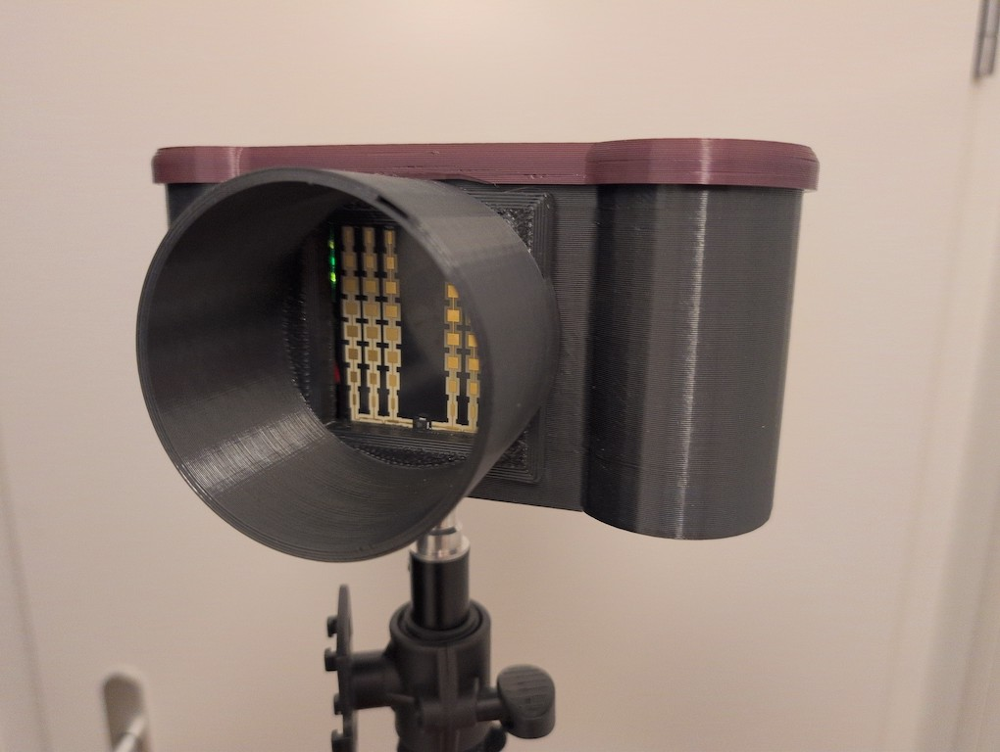
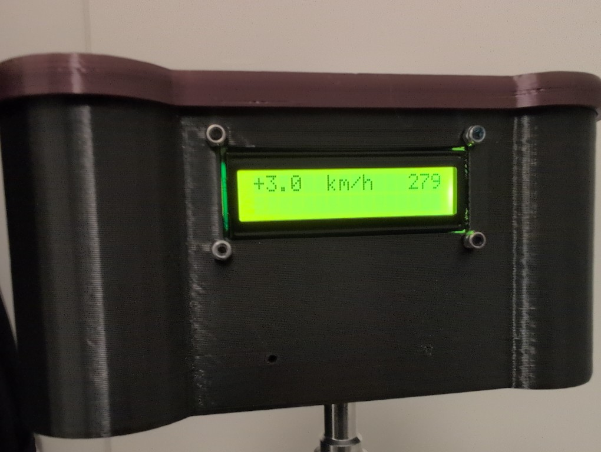

# RadarSpeedgun-HLK-LD2415H #
is a simple fun project, inspired by the info posts often seen around schools. License is GPL v3.

## Intention ##
to measure and display speed of passing vehicles (or persons). 

## Simple setup ##
utilizes sensor HLK-LD2415H, 2*16 LCD-display, buzzer and arduino pro mini 3.3V, 8MHz. Power comes from 
either 3S lipo or 3 LiIon cells 18650 of your choice. 

## Build ##
* common ground between battery, sensor, display, arduino
* straight connects between sensor and arduino for software-serial
* straight connects between display and arduino for i2c
* optional buzzer connected to arduino
* 3 cells in series,
  *  power display from 1S,
  *  power arduino from 2S,
  *  power sensor from 3S
* compile and upload software via arduino IDE. (requires some typical libraries to be installed)    
* stl-files for 3D-printable casing included

## Run ##
connect balancer plug for power (or insert 3 LiIon cells). Aim at traffic, observe continuous 
periodic measurements of approaching and departing vehicles and persons.
In detail: top row has latest measurement on the left and fastest measurement of last 3 seconds on right, 
the second row shows diagnostic info

